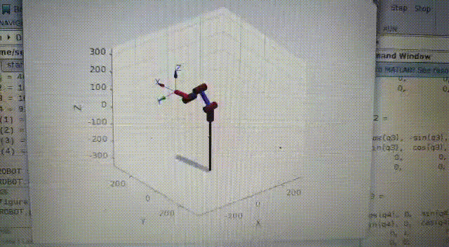

# Laboratorio 5.
## Robótica - Universidad Nacional De Colombia - Sede Bogotá.
### Sebastian Cubides - Julián Velandia.
***
### Cinemática inversa:

* Videos del Funcionamiento:

Se realizó una descripción geométrica del robot como se ve en la siguiente imagen.

De este análisis se concluyen las siguiente ecuaciones para las diferentes variables de articulación.

    q5 se mantiene fija en pi/2 si se quiere que el gripper esté cerrado.

Por último se realizó la comprobación de la cinemática usando el toolbox de Peter Corke en Matlab, disponible en el archivo DH.m

***

### Descripción de la solución planteada:
Se diseño un script en python, el cuál le solicita al usuario indicar una posición preestablecida o la figura que desee dibujar.
Se programaron las trayectorias usando la cinemática inversa previamente hallada, para dibujar el espacio de trabajo, un triángulo, un círculo, tres líneas paralelas, 5 puntos y una letra.
Adicionalmente el usuario puede llevar al robot a la posición de Home y a una posición especial para la colocación de la herramienta que contiene al marcador.

El programa consiste en 3 archivos .py y un archivo .csv. El archivo .csv contiene todos los puntos x,y,z para cada una de las figuras y trayectorias; En los scripts de python tenemos uno que se encarga de leer estos puntos del archivo .csv, aplicarles la cinemática inversa y retornar un vector con los valores de todas las variables articulares para el punto. Otro de los archivos de python se encarga de recibir este vector de variables articulares y mediante ela función JointTrayectoryPoint(), se publica está información para que el robot pueda leerla y ejecutarla. Finalmente el último archivo de python es main.py, que se encarga de instanciar el robot y llamar a todos los demás 

***

### Verificación Dimensional:
Durante el procedimiento de escritura se evidenció que los ejes x e y interpretados por el robot, eran distintos a los planteados originalmente.
La diferencia radicaba en qué la orientación del sistema real no coincidía con lo esperado, por lo cual fue necesario rehacer las coordenadas para los puntos de cada una de las figuras plateadas.
Se evidenció ademas un error de al rededor de 1cm.

***

### Evidencia de la solución realizada:

En los siguientes videos e imágenes se evidencia el funcionamiento del programa implementando.

